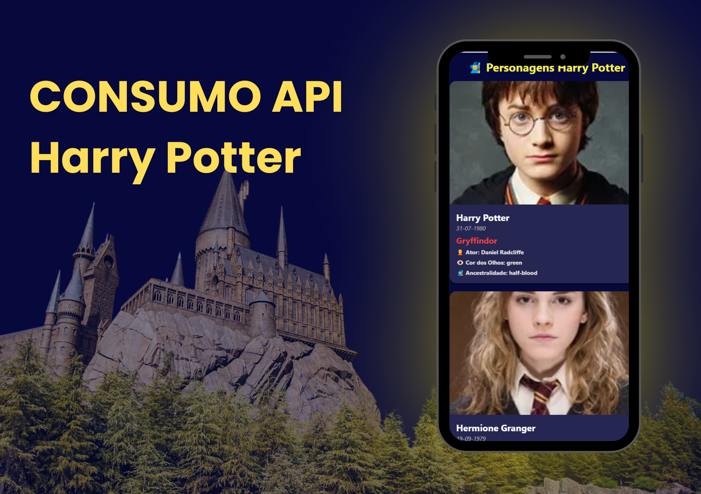

# Consumo de API - Harry Potter



## Descrição do Projeto
## 🪄 Descrição do Projeto
Este projeto é um aplicativo que consome a API de Harry Potter para exibir informações sobre personagens, feitiços, casas e outros elementos do universo mágico. Ele foi desenvolvido com o objetivo de praticar o consumo de APIs e a criação de interfaces interativas.

## ✨ Funcionalidades

- Listagem de personagens com detalhes como nome, casa e varinha.
- Pesquisa por feitiços e suas descrições.
- Informações sobre as casas de Hogwarts.
- Interface amigável e responsiva.

## 🛠️ Tecnologias Utilizadas

<p align="center">
    
    
    
    
</p>

## 🚀 Como Executar o Projeto

1. Clone o repositório:
    ```bash
    git clone https://github.com/seu-usuario/ATV-mobile-studio-ghibli.git
    ```
2. Navegue até o diretório do projeto:
    ```bash
    cd ATV-mobile-studio-ghibli
    ```
3. Instale as dependências:
    ```bash
    npm install
    ```
4. Execute o aplicativo:
    ```bash
    npm start
    ```

## 🗂️ Estrutura do Projeto

- **src/components:** Componentes reutilizáveis.
- **src/screens:** Telas do aplicativo.
- **src/services:** Configuração de requisições para a API.


